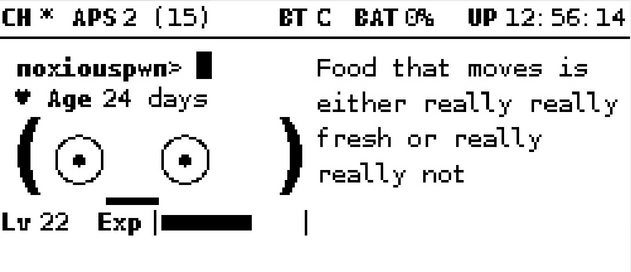

# Shower Thoughts Pwnagotchi Modification



## Introduction

This modification displays random r/showerthoughts headlines on your pwnagotchi when the device is waiting. 

It is a fun way to add some personality to your pwnagotchi and keep you entertained.

NOTE: All other phrases used by pwnagotchi will still display as normal, but waiting...(x Sec), etc... is replaced with a call to read a modified copy of the official r/showerthoughts rss feed. 
It is modified by a python program that only saves valid headlines to an rss file called shortshowerthoughts.rss
This means once you have some headlines you won't need the internet for them to display and your list of phrases will grow every time a valid (Less then 68 characters long) headline is posted, once connected again to the internet.


To do the modification, follow the instructions in the configuration section. 

You will need internet to the Pwnagotchi for these steps to work.

And every time it needs to download the RSS feed. (It will wait until the internet is restored to perform the download.)

First, get a shared internet connection via BT or through your host machine. 

(If you are running a Pi3 or 4 and have an ETH port just connect that port to your router and follow along.)

Copy the commands here and paste them in order in a terminal window. (just right click in the terminal window to paste from the clipboard)

SSH into your Pi and follow the configuration below

## Configuration


Go superuser
```bash
sudo su
```
Download Showerthoughts RSS feed to root. 
```bash
curl --silent https://www.reddit.com/r/showerthoughts/.rss --user-agent 'Mozilla' --output /root/showerthoughts.rss
```
Downloads remove_long_titles.py to /usr/local/bin
```bash
wget -P /usr/local/bin https://raw.githubusercontent.com/NoxiousKarn/Showerthoughts/main/remove_long_titles.py
```
Run remove_long_titles.py
```bash
python /usr/local/bin/remove_long_titles.py
```
Download modified voice.py from this repo and place in /usr/local/lib/python3.7/dist-packages/pwnagotchi/ it should save as voice.py.1
```bash
wget -P /usr/local/lib/python3.7/dist-packages/pwnagotchi/ https://raw.githubusercontent.com/NoxiousKarn/Showerthoughts/main/voice.py
```
Rename voice.py to voice.py.old and then rename voice.py.1 to voice.py.
```bash
mv /usr/local/lib/python3.7/dist-packages/pwnagotchi/voice.py /usr/local/lib/python3.7/dist-packages/pwnagotchi/voice.py.old ; mv /usr/local/lib/python3.7/dist-packages/pwnagotchi/voice.py.1 /usr/local/lib/python3.7/dist-packages/pwnagotchi/voice.py
```
Set Cronjobs to download the RSS every 4 hours, then run remove_long_titles.py to remove long Headlines in the feed file every 4 hours
```bash
(echo "0 */4 * * * curl --silent https://www.reddit.com/r/showerthoughts/.rss --user-agent 'Mozilla' --output showerthoughts.rss" ; echo "0 */4 * * * /usr/bin/python3 /usr/local/bin/remove_long_titles.py >/dev/null 2>&1") | crontab -
```
Reboot Pwnagotchi
```bash
touch /root/.pwnagotchi-auto && systemctl restart pwnagotchi
```

Once loaded in auto mode you should see new phrases appear regularly.

This is a single command that performs all of the above at once in order.
```bash
sudo su -c 'curl --silent https://www.reddit.com/r/showerthoughts/.rss --user-agent "Mozilla" --output /root/showerthoughts.rss && \
wget -P /usr/local/bin https://raw.githubusercontent.com/NoxiousKarn/Showerthoughts/main/remove_long_titles.py && \
python /usr/local/bin/remove_long_titles.py && \
wget -P /usr/local/lib/python3.7/dist-packages/pwnagotchi/ https://raw.githubusercontent.com/NoxiousKarn/Showerthoughts/main/voice.py && \
mv /usr/local/lib/python3.7/dist-packages/pwnagotchi/voice.py /usr/local/lib/python3.7/dist-packages/pwnagotchi/voice.py.old && \
mv /usr/local/lib/python3.7/dist-packages/pwnagotchi/voice.py.1 /usr/local/lib/python3.7/dist-packages/pwnagotchi/voice.py && \
(echo "0 */4 * * * curl --silent https://www.reddit.com/r/showerthoughts/.rss --user-agent 'Mozilla' --output showerthoughts.rss" ; echo "0 */4 * * * /usr/bin/python3 /usr/local/bin/remove_long_titles.py >/dev/null 2>&1") | crontab - && \
touch /root/.pwnagotchi-auto && systemctl restart pwnagotchi'

```
## Usage
It's just gonna run by itself you don't need to do anything for the phrases to start. Every 4 hours it will DL the RSS and then remove the long headlines, if you don't have internet after the 4-hour mark it will wait for the internet and download the feed then. 


## Uninstalling
If you want to undo what we did SSH in.

Go Superuser
```bash
sudo su
```
Remove voice.py then rename voice.py.old to voice.py
```bash
rm /usr/local/lib/python3.7/dist-packages/pwnagotchi/voice.py ; mv /usr/local/lib/python3.7/dist-packages/pwnagotchi/voice.py.old /usr/local/lib/python3.7/dist-packages/pwnagotchi/voice.py
```
Remove remove-long-titles.py
```bash
rm /usr/local/bin/remove_long_titles.py
```
Remove showerthoughts.rss file from our root folder
```bash
rm /root/showerthoughts.rss
```
Remove shortshowerthoughts.rss Skip this step if you want to keep already collected headlines for reinstall
```bash
rm /root/shortshowerthoughts.rss
```
Remove cronjobs from crontab manually Delete the lines we added and save
```bash
crontab -e
```
save
Ctrl+O
save as named
[enter]
Exit
Ctrl+X

Reboot Pwnagotchi
```bash
touch /root/.pwnagotchi-auto && systemctl restart pwnagotchi
```
## One command works but first you have to manually delete the cronjobs

```bash
crontab -e
```
Delete the two added lines, save(ctrl+o) and close(ctrl+x). 

Then Paste the following to remove all of our changes:

```bash
sudo su -c 'rm /usr/local/lib/python3.7/dist-packages/pwnagotchi/voice.py ; \
mv /usr/local/lib/python3.7/dist-packages/pwnagotchi/voice.py.old /usr/local/lib/python3.7/dist-packages/pwnagotchi/voice.py ; \
rm /usr/local/bin/remove_long_titles.py ; \
rm /root/showerthoughts.rss ; \
rm /root/shortshowerthoughts.rss ; \
touch /root/.pwnagotchi-auto && systemctl restart pwnagotchi'
```
   There all gone and back to normal!

## License
The plugin is licensed under the GPLv3 license.
